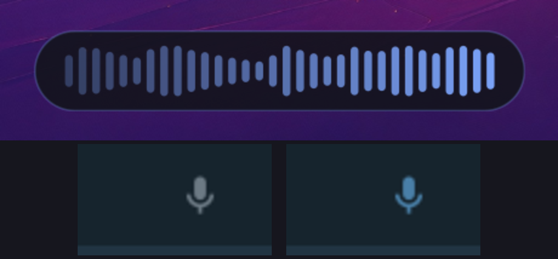

# AirType for Omarchy

Fast local push-to-talk speech-to-text for [Omarchy](https://omarchy.org), with a theme-matched recording waveform and an Omarchy bar widget. Built for Omarchy / Hyprland, usable on any Wayland or X11 desktop.



Hold **Super** and double-tap **Alt** to start recording. Tap **Alt** once to stop. AirType transcribes locally, copies the text, and pastes it into the focused window. If the focused window is a terminal (foot, ghostty, alacritty, kitty, ...), it pastes with Ctrl+Shift+V; everywhere else it uses Ctrl+V.

While you talk, a small waveform pill floats above the bottom edge of the focused monitor, drawn in your active Omarchy theme's accent color. The bars follow your real microphone level and the pill fades out when you stop.

## Why AirType

- **Zero idle cost.** The service holds no model when you are not dictating: about 26 MB of RAM and ~0% CPU. The ASR model unloads after every transcription and the memory is returned to the OS.
- **No cold-start wait.** The microphone opens the instant you hit the hotkey. The model loads in the background during the first seconds of your speech, while the audio is already being captured, so nothing is lost and nothing blocks.
- **Near-realtime transcription.** While you talk, AirType transcribes pause-aware chunks in the background. When you stop, only the last few seconds remain to process, so the text pastes almost instantly - even on CPU-only laptops with no NVIDIA GPU.
- **No recording time limit.** Dictate for 30 seconds or 30 minutes; paste latency stays the same because the work already happened while you spoke. There is no duration cap anywhere in the pipeline.
- **Fits Omarchy.** Theme-matched waveform overlay, bar indicator, terminal-aware paste, systemd user service, gum settings menu.

## Install the dictation service

Requires [uv](https://docs.astral.sh/uv/) and Python 3.12+.

```bash
uv tool install git+https://github.com/topmass/airtype-for-omarchy
airtype setup      # downloads the model (~480 MB) on first run
airtype install    # installs + starts the systemd user service
airtype doctor     # verify everything is green
```

Requirements on Wayland: `wl-clipboard`, `wtype`, and your user in the `input` group (for global hotkeys via evdev):

```bash
sudo pacman -S wl-clipboard wtype
sudo usermod -aG input $USER   # then log out and back in
```

The waveform overlay uses the system GTK4 stack (`gtk4-layer-shell`, `python-gobject`, `python-cairo`), all stock on Omarchy. Without them the overlay quietly stays off and dictation is unaffected.

## Install the bar widget (Omarchy plugin)

This repo is also an Omarchy shell plugin: a microphone indicator for the bar that shows live state (idle, recording, transcribing) and toggles recording on click.

```bash
omarchy plugin add https://github.com/topmass/airtype-for-omarchy.git
omarchy plugin enable topmass.airtype
```

The indicator sits dim while idle, pulses in your theme's active color while recording, and shows an hourglass while transcribing. If the AirType service is not running it shows a muted mic-off glyph. A widget setting (`Show icon when idle`) lets you hide it entirely except during dictation.

## Usage

- `airtype` - settings menu (gum-based): model swap/download/delete, paste mode, hotkey, terminal classes, sounds, waveform overlay
- `airtype toggle` / `airtype status` - control the running service
- `airtype record` - one-shot dictation in a terminal (Enter to stop)
- `airtype transcribe file.wav` - transcribe an audio file
- `airtype models` - list available models
- `airtype settings --json` - scriptable settings
- `airtype doctor` - health checks

Config lives at `~/.config/airtype/config.json` and hot-reloads into the running service. `overlay_enabled` turns the waveform overlay on or off.

## Uninstall

```bash
omarchy plugin remove topmass.airtype   # remove the bar widget
airtype uninstall                       # stop + remove the systemd service
uv tool uninstall airtype               # remove the CLI and venv
rm -rf ~/.config/airtype ~/.cache/airtype   # config and downloaded models
```

## Models

All models run on CPU via sherpa-onnx int8 ONNX:

| Key | Model | Notes |
|---|---|---|
| `parakeet-unified-en-0.6b-int8` (default) | NVIDIA Parakeet Unified EN 0.6B | English, punctuation + capitalization |
| `parakeet-tdt-0.6b-v3-int8` | Parakeet TDT v3 | 25 European languages |
| `parakeet-tdt-0.6b-v2-int8` | Parakeet TDT v2 | legacy, no punctuation |
| `moonshine-base-en` | Moonshine Base EN | 145 MB light tier for weak hardware |

Models download on demand from the sherpa-onnx release page into `~/.cache/airtype/models/`.

## How the hotkey works

The service reads `/dev/input` key events directly (evdev), below the compositor, so hotkeys work in any app including fullscreen windows and nothing is grabbed - your keys still reach applications normally. The state machine ignores chords like Alt+Tab while recording, tolerates releasing Super slightly before the second Alt tap, and waits for your modifiers to be released before sending the paste keystroke.

## How the waveform overlay works

The overlay is a GTK4 + gtk4-layer-shell window spawned per recording under the system python3 (it cannot live in the tool's venv). The recording pipeline streams microphone RMS levels to it over a pipe. Colors are read at spawn from `~/.local/state/omarchy/current/theme/colors.toml`, so the overlay always matches the active theme with zero configuration. The pill is click-through and never takes keyboard focus. On non-Omarchy systems it falls back to neutral colors.

## Development

```bash
git clone https://github.com/topmass/airtype-for-omarchy
cd airtype-for-omarchy
uv sync
uv run python -m unittest discover tests
```

The Python service lives in `src/airtype/`, the bar widget in `shell/BarWidget.qml`, and the plugin manifest at `manifest.json`. See `project-specsheet.md` for the architecture map and the rules that keep everything working.

## License

MIT
